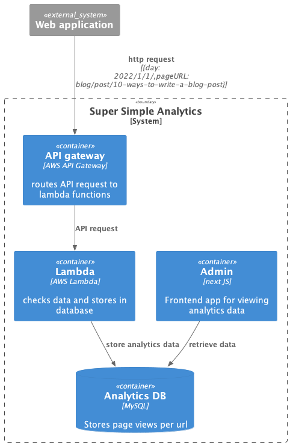

#Super Simple Analytics

Like the name suggest this is a proof of concept for web page analytics system that tracks the 
number of page views per page on a given day and nothing else hence the reason it is super simple. 

It integrates AWS api gateway with a lambda function that accepts a post request from your site 
and saves the data to a mysql DB.

There is also a simple frontend application (located in the admin folder) that displays your analytics results 

**This is just a proof of concept so probably not something to be used in production but it does provide
a basis on which you can expand on if you want to build your own.**

##Integrating with your web application
Super Simple Analytics expects a post request with a JSON body in the format

``
{
  day: 2022/1/1/,
  pageURL: "blog/post/10-ways-to-write-a-blog-post",
}
``
With the above in mind in Javascript you might do something like this every time a page is viewed on your site

``
const option = {
  method: 'POST',
  body: JSON.stringify({
  day: `${date.getDay()}/${date.getMonth()}/${date.getFullYear()}`, 
  pageURL: window.location.pathname || path,
  }),
};
fetch(endpoint, { ...option })
.then((response) => response.text())
.catch((err) => console.log(err));
``

Below are instructions on how to run Super Simple Analytics on AWS or on your local machine

##Deploying to AWS
The instructions below are just for deploying the lambda and supporting services. Currently there is no infrastructure
code for deploying the frontend admin app.

1. First build the lambda function, from the root of this project run
`npm run build`
2. Then deploy to AWS using terraform
3. Update `terraform/terraform.tfvars` with the relevant variable values
4. `cd terraform/`
5. `terraform init` 
    * (if this is your first time running the application)
6. `terraform plan`
    * If your happy with the plan you can proceed
7. `terraform apply`

###Clean up
If you want to delete what was built 
`terraform destroy`

###Cost
Note this example may incur a cost, so check the pricing structures for services used in this example

##Local development
If you want to explore/extend on this super simple proof of concept. Everything you need to get
started is located in this repo. Follow the steps below to get setup
###Prerequisites
Make sure you have the following installed on your local machine
1. [Install and setup aws cli](https://docs.aws.amazon.com/cli/latest/userguide/getting-started-install.html#getting-started-install-instructions)
2. [Install docker](https://docs.docker.com/desktop/)

###Run locally
Backend app
1. `docker compose up` to launch the mysql DB
2. `cd backend`
3. Setup DB tables `npm run build-db-tables` 
4. Import some dummy data into DB `npm run build-db-data` 
5. Invoke the lambda function locally `npm run invoke-lambda`
   You can make changes to the lambda function itself from `src/index.ts`. The function is written in typescript and
   compilation to js is handled when you run `npm run invoke-lambda` @see `package.json` for more info

Frontend app
Is built using next js
1. `cd admin`
2. `npm run dev`
